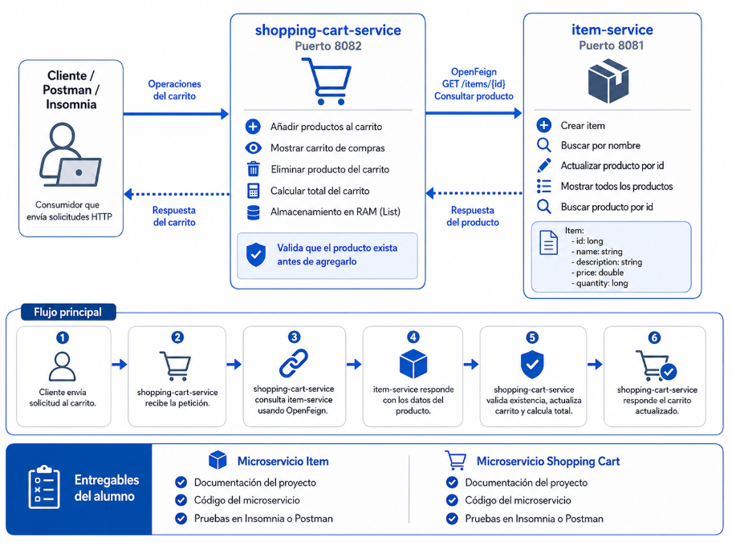

# Proyecto final

Se requiere la creación de 2 microservicios para  nuestra tienda virtual. 

## Microservicio Item
Este microservicio representa la administración de productos. 

### Funcionalidades
Se requiere que este microservicio tenga las siguientes funciones:

1. Crear un item, atributos necesarios:
    - id (long)
    - name (string)
    - description (string)
    - price (double)
    - quantity(long)

2. buscar por nombre
3. actualizar un producto por id
4. mostrar todos los productos
5. buscar producto por id. 

### Requerimientos
Al final el alumno debe de tener:
1. Documentación de su proyecto.
2. Código de su microservicio
3. Pruebas en insomnia o postman

## Microservicio Shopping Cart.
Este microservicio representa un carrito de compras para nuestra tienda virtual. 

> **Nota:** En esta primer versión el carrito de compras almacenará la información en RAM (usar List). 

### Funcionalidades. 

Se requiere que este microservicio tenga las siguientes funciones:

1. Añadir productos al carrito, es importante mencionar que no puede agregar productos que no existen. 
2. total del carrito de compras, dependiendo de los productos agregados debe de mostrar el total de carrito. 
3. Eliminar producto del carrito. 
4. mostrar carrito de compras. 

### Requerimientos
Al final el alumno debe de tener:
1. Documentación de su proyecto.
2. Código de su microservicio
3. Pruebas en insomnia o postman